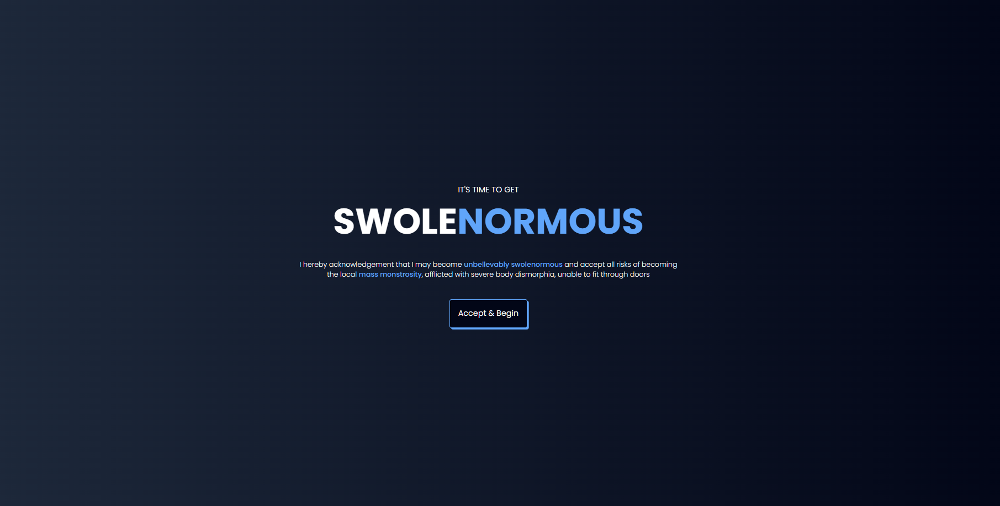

<link rel="stylesheet" href="../anjhelo-vela/static/custom-anjhelo.css">
<link href="https://cdn.jsdelivr.net/npm/remixicon@2.5.0/fonts/remixicon.css" rel="stylesheet">

    <section id="hero" class="hero">
            

                

                    

                        <h1 class="hero__title">Hola, soy Anjhelo Elvis Vela Yauri, Web Developer.</h1>
                        
Hola mi nombre es Anjhelo Elvis Vela Yauri, soy desarrollador Full-Stack. Soy un apasionado por las nuevas tecnologias y los diseños Interactivos.

                        

                            

                                
02

                                <h2 class="hero__info-title">Years Experience</h2>
                            

                            

                                
20+

                                <h2 class="hero__info-title">Projects Completed</h2>
                            

                        

                    

                    
                

            

        </section>
        <section id="about" class="section about" style="width: 70%;">
            

                

                    <h2 class="section__title">Sobre mi</h2>
                    Quien Soy
                

                

                    

                        <h3 class="about__title">Soy un Desarrollador Experimentado Full Stack</h3>
                        
Hola! Soy Anjhelo Vela un desarrollador Full-Stack apasionado por aprender nuevas tecnologias

                        <a href="https://www.linkedin.com/in/anjhelo-vela" class="btn btn--primary">Conoceme</a>
                    

                    

                        <h3 class="skills__title">Tecnologías:</h3>
                        

                            

                                <h4 class="skills__subtitle">Backend</h4>
                                <ul class="skills__list">
                                    <li class="skills__item"><i class="ri-arrow-right-s-fill"></i>Node.js</li>
                                    <li class="skills__item"><i class="ri-arrow-right-s-fill"></i>Python</li>
                                    <li class="skills__item"><i class="ri-arrow-right-s-fill"></i>Java</li>
                                    <li class="skills__item"><i class="ri-arrow-right-s-fill"></i>MongoDB</li>
                                    <li class="skills__item"><i class="ri-arrow-right-s-fill"></i>MySQL</li>
                                </ul>
                            

                            

                                <h4 class="skills__subtitle">Frontend</h4>
                                <ul class="skills__list">
                                    <li class="skills__item"><i class="ri-arrow-right-s-fill"></i>React</li>
                                    <li class="skills__item"><i class="ri-arrow-right-s-fill"></i>Typescript</li>
                                    <li class="skills__item"><i class="ri-arrow-right-s-fill"></i>JavaScript</li>
                                    <li class="skills__item"><i class="ri-arrow-right-s-fill"></i>Tailwind</li>
                                    <li class="skills__item"><i class="ri-arrow-right-s-fill"></i>Next.js</li>
                                </ul>
                            

                        

                    

                

            

        </section>
        <section id="qualification" class="section qualification">
            

                

                    <h2 class="section__title">Educación</h2>
                    Educación
                

                <!--= Education =-->
                

                    <h3 class="qualification__name">
                        <i class="ri-booklet-fill"></i>
                        Education
                    </h3>
                    

                        <!--= Education 1 =-->
                        

                        <!--= Education 1 =-->
                            

                                <h3 class="qualification__title">4Geeks Bootcamp</h3>
                                

                                    Completé un bootcamp intensivo en el que fortalecí mis habilidades en desarrollo full-stack, trabajando con tecnologías modernas como React, Node.js y Express. Además, aprendí principios de diseño para crear interfaces web bonitas e intuitivas.
                                

                                2024 - 2025
                            

                            <!--= Education 2 =-->
                            

                                <h3 class="qualification__title">Universidad Continental</h3>
                                

                                    Actualmente curso la carrera de Ingeniería de Sistemas e Informática, donde adquiero una sólida base teórica y práctica en el desarrollo de software, consolidando mis conocimientos en tecnologías web y metodologías ágiles.
                                

                                2020 - Present
                            

                        

                    

                

            

        </section>
            <section id="service" class="section service" style="width: 70%;">
            

                

                    <h2 class="section__title">Services</h2>
                    What I do
                

                

                    <!--= service card 1 =-->
                    

                        

                            <i class="ri-layout-4-fill"></i>
                        

                        <h3 class="service__title">Frontend Development</h3>
                        <a href="https://github.com/LOHAN2000/App_Gym_React" class="service__link">Know More !</a>
                    

                    <!--= service card 2 =-->
                    

                        

                            <i class="ri-code-s-slash-line"></i>
                        

                        <h3 class="service__title">Backend  Development</h3>
                        <a href="https://github.com/LOHAN2000/REST-API-NODE-MYSQL" class="service__link">Know More !</a>
                    

                

            

        </section>
            <section id="project" class="section project" style="width: 70%; margin-bottom: 30rem;">
            

                

                    <h2 class="section__title">Proyectos</h2>
                    Mis trabajos recientes
                

                

                    <!--= project 1 =-->
                    

                        
                        <h3 class="project__title">Twitter clone</h3>
                        
 Copia de la pagina web twitter usando tecnologias como: React, MongoDB, express, etc.
                        

                        <a href="https://twitter-clone-xiic.onrender.com" class="project__link">Demo
                            <i class="ri-arrow-right-line"></i></a>
                    

                    <!--= project 2 =-->
                    

                        
                        <h3 class="project__title">Inventory App</h3>
                        
 Aplicación que sirve para registrar productos en una base de datos usando MERN.
                        

                        <a href="https://mern-app-inventory.onrender.com" class="project__link">Demo
                            <i class="ri-arrow-right-line"></i></a>
                    

                    <!--= project 3 =-->
                    

                        
                        <h3 class="project__title">Gym React App</h3>
                        
 Aplicacion que sirve para generar rutina para el gimnasio, utilizando React y Javascript.
                        

                        <a href="https://gym-app-anjhelo.netlify.app" class="project__link">Demo
                            <i class="ri-arrow-right-line"></i></a>
                    

                

            

        </section>

